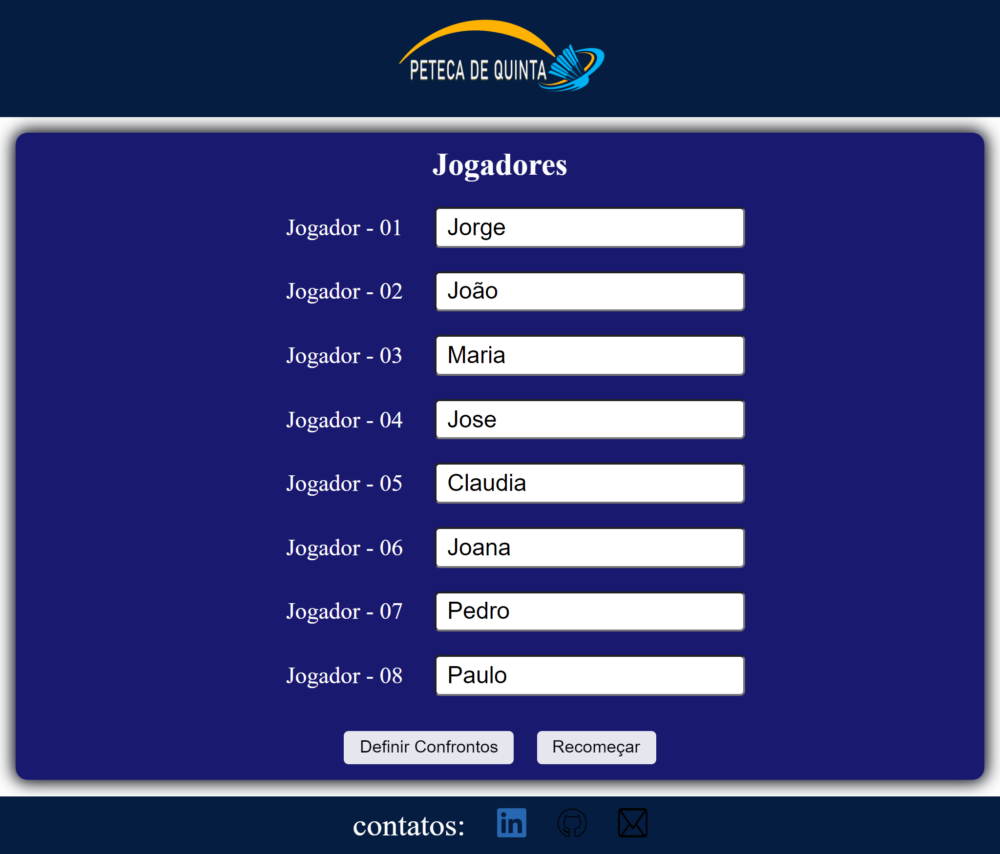
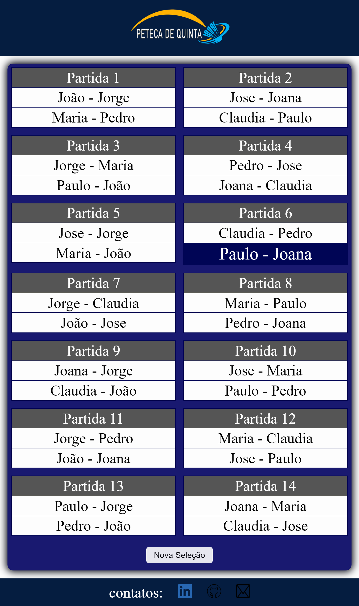
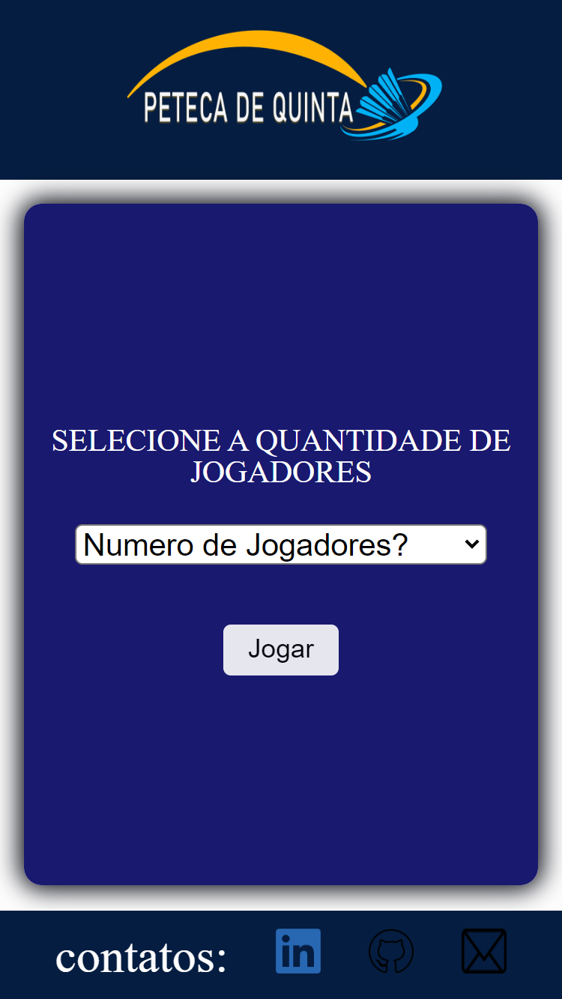
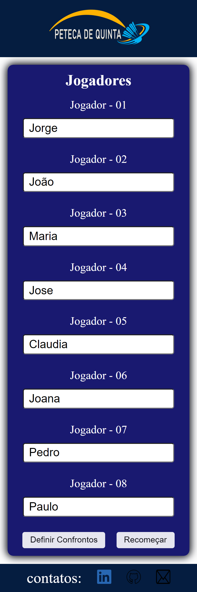
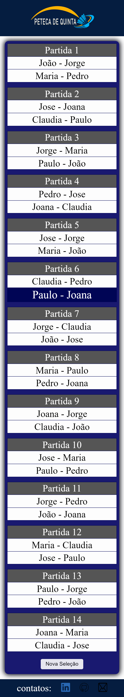

# **Definição de duplas para disputa de partidas de peteca.** <h1>

Deseja conferir como ficou o resultado do projeto? Teste a funcionalidade através deste Link: [Clique Aqui]( https://cadastro-para-esquema-de-cruzamento-em-duplas-par-jorgedeaquino.vercel.app/).

## **Demonstração Desktop**
  
  

## **Demonstração Mobile** <h2>

  

## **Sobre o Projeto** <h2>
  
Este projeto surgiu por meio de um desafio para criar um projeto do zero em apenas uma semana, através da mentoria do [Pedro Marins]( https://www.linkedin.com/in/pedromarins/) e [Henrique de Andrade]( https://www.linkedin.com/in/henrique-de-andrade/).
Como funcionalidades, possibilita uma distribuição de duplas para disputa do jogo de peteca, de 5 a 10 participantes e realiza a definição dos confrontos, de maneira que os jogadores disputem a mesma quantidade de partidas.

  
## **Tecnologias Utilizadas** <h2>

* JavaScript 
  
* HTML 
  
* CSS 

  
  
  
Contato: [Linkedin]( https://www.linkedin.com/in/jorge-alexandre-de-aquino/)
